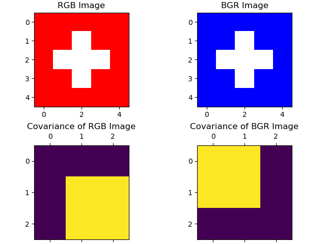

# Image Processing
Image Processing scripts for IPCV1 course at OST university

## Scripts
The scripts included in this repository should help other students to prepare for the exam of the IPCV1 course at OST university. The scripts visualize and illustrate certain topics of Image Processing and are related to the content taught at OST university.

### Script 1: `brightness_enhancement.py`
This script shows how a normal distributed image can be multiplied by two (stretching) without changing its mean:

### Script 2: `convolved_normal_distribution.py`
This script illustrates the distribution of a convolved normal distributed image by the kernel [-1, 2, -1].

### Script 3: `covariance_rgb_channels.py`
This script shows the covariance matrix of the original image and the one of red and blue channels switched:

### Script 4: `geometric_tranformations.py`
This script implements the affine transform for rotation of an image. 

The result for 30° might look weird but the rotation happens __around the orgin__ which is at (0,0).

### Script 5: `histogram_equalization_error.py`
This script shows erroneous histogram equalization (r**2 instead of r). Every intensity greater than 16 is mapped to 255:

### Script 6: `laplacian_ft.py`
This script implements the Laplacian _filter transfer function_ to perform contrast enhancement:

It also illustrates the Laplacian filter transfer functions as graphs:

### Script 7: `laplacian.py`
This script implements the Laplacian _spatial kernel_ as a convolution in the frequency domain to perform contrast enhancement:

### Script 8: `sobel_operators.py`
This script implements sobel operators and shows the results in x- and y-direction as well as the magnitude image:

### Script 9: `standard_deviation.py`
This script shows the distribution of squared normal distributed values:

Note that the resulting mean is the standard deviation squared.

### Script 10: `uniform_pdf_addition.py`
This script shows the result of adding the PDFs of multiple uniformly distributed random variables:

Note that the result is a normal distribution with mean=N/2 where N is the number of added random variables.

### Script 11: `wraparound.py`
This script shows the wraparound-error of convolution in the frequency domain with a kernel of size (11, 11):

